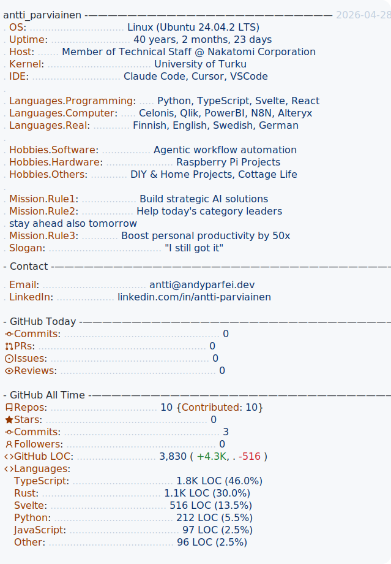

<a href="https://github.com/andyparfei/andyparfei">
<picture>
  <source media="(prefers-color-scheme: dark)" srcset="./dark_portrait.apng">
  
</picture>
<picture>
  <source media="(prefers-color-scheme: dark)" srcset="./dark_stats.svg">
  
</picture>
</a>
